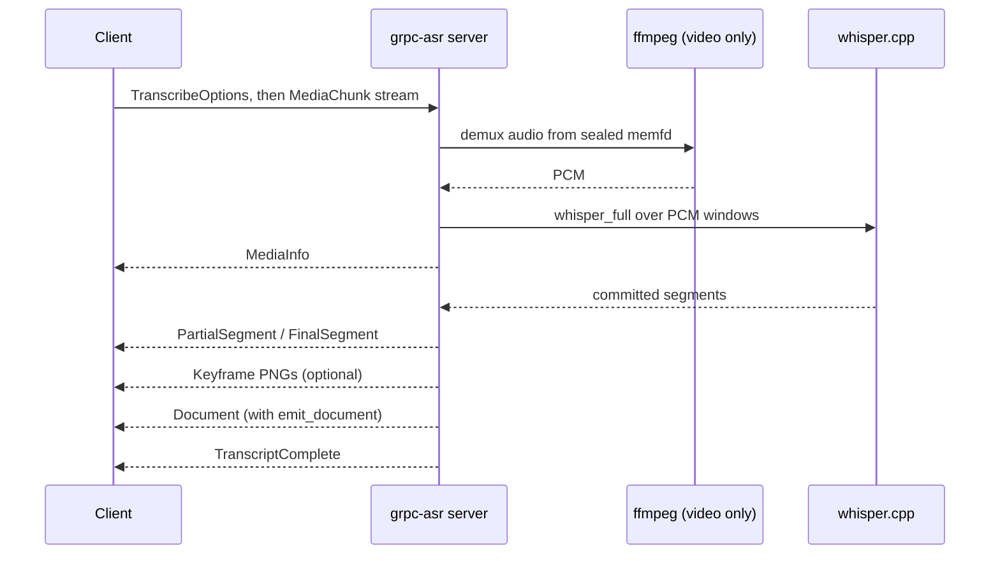

# grpc-asr

gRPC ASR collector (whisper.cpp) for audio and video, projecting transcripts
into the gRParse Document data plane.

A standalone C++ gRPC server embedding whisper.cpp. Media streams in over a
bidirectional `Transcribe` RPC; timed transcript segments stream back as the
decoder commits them, so for audio containers transcription starts while the
upload is still in flight. Video containers are demuxed through ffmpeg over a
memfd (diskless), with optional keyframe stills emitted alongside the
transcript.



## Wire API

`ai.pipestream.asr.v1.AsrService` (see
[`proto/ai/pipestream/asr/v1/asr_service.proto`](proto/ai/pipestream/asr/v1/asr_service.proto)).

`Transcribe(stream TranscribeRequest) returns (stream TranscribeResponse)`:
the first request message carries `TranscribeOptions` (`model`, `language`,
`task`, `word_timestamps`, `emit_keyframes`, `keyframe_interval_seconds`,
`emit_document`), the rest carry the encoded media as `MediaChunk` messages.
Response events arrive in order: `MediaInfo`, then `PartialSegment` and
`FinalSegment` events (finals replace partials by index), optional `Keyframe`
PNGs, and a `TranscriptComplete` trailer with counts.

With `emit_document`, one `ai.pipestream.document.v1.Document` event is
emitted immediately before the trailer: the collector-side fold of the
transcript. Final segments become text items with `TrackSource` time ranges
and `CollectorSource{collector: "asr", model, confidence:
exp(avg_logprob)}`; keyframes become picture items whose `ImageRef.uri` is
`keyframe:<timestamp_ms>`, a pointer back at the typed event rather than
embedded PNG bytes, so the Document stays one bounded message. The typed
event stream remains the lossless wire. The document schema is vendored
verbatim from gRParse (`proto/ai/pipestream/document/v1/document.proto`); do
not edit it here.

`GetServiceInfo` reports the build, backend, loaded models, and caps, plus
the `UiInfo` block the shared demo shell reads to build its tab bar.
Standard `grpc.health.v1.Health` and server reflection are registered.

Containers: wav, mp3, flac, ogg decode in process; mp4/mov and mkv/webm are
demuxed by ffmpeg (video needs an audio track). Errors: cap overruns are
`RESOURCE_EXHAUSTED`, undecodable media is `INVALID_ARGUMENT`, unknown
containers are `UNIMPLEMENTED`, decoder faults are `INTERNAL`.

## Build and test

```bash
cmake -S . -B build -G Ninja -DCMAKE_BUILD_TYPE=Release -DBUILD_TESTING=ON
cmake --build build --target grpc-asr-server grpc-asr-tests
ctest --test-dir build -L asr --output-on-failure
```

gRPC and whisper.cpp are FetchContent-pinned; no system gRPC needed. Two
tests need provisioning and skip (exit 77) without it: `transcriber-test`
and `asr-service-test` need `models/ggml-tiny.en.bin` (`curl -L -o
models/ggml-tiny.en.bin
https://huggingface.co/ggerganov/whisper.cpp/resolve/main/ggml-tiny.en.bin`),
and the video cases need `ffmpeg` and `ffprobe` on PATH.

Backend variants: `-DGRPC_ASR_CUDA=ON` (GGML CUDA) and
`-DGRPC_ASR_OPENVINO=ON` (whisper OpenVINO encoder; needs the OpenVINO SDK
at build time and ships as `Dockerfile.openvino`).

## Run

```bash
GRPC_ASR_BACKEND=cpu GRPC_ASR_MODELS_DIR=./models ./build/grpc-asr-server
```

The process loads every configured model at startup and fails loud: a
missing backend or weight file stops the boot, never the first RPC. Weights
are files named `ggml-<model>.bin` in the models dir; `GRPC_ASR_MODELS`
picks a subset, unset discovers all.

| Env | Default | Meaning |
|---|---|---|
| `GRPC_ASR_LISTEN_ADDRESS` | `0.0.0.0:50055` | listen address |
| `GRPC_ASR_BACKEND` | `cuda` | `cuda` \| `openvino` \| `cpu`; never silently substituted |
| `GRPC_ASR_CUDA_DEVICE` | `0` | CUDA device index |
| `GRPC_ASR_MODELS_DIR` | `/models` | read-only weight mount |
| `GRPC_ASR_MODELS` | discover | comma list of model names to load |
| `GRPC_ASR_CONCURRENCY` | `2` | whisper states per model (concurrent transcriptions) |
| `GRPC_ASR_MAX_MEDIA_BYTES` | `268435456` | upload cap, overrun is `RESOURCE_EXHAUSTED` |
| `GRPC_ASR_MAX_DURATION_SECONDS` | `14400` | media duration cap, overrun is `RESOURCE_EXHAUSTED` |
| `GRPC_ASR_WINDOW_SECONDS` | `480` | PCM window per `whisper_full`; bounds resident PCM |
| `GRPC_ASR_THREADS` | `min(4,hw)` | whisper decode threads |
| `GRPC_ASR_KEYFRAME_INTERVAL_SECONDS` | `10` | default keyframe spacing |
| `GRPC_ASR_METRICS_INTERVAL_SECONDS` | `60` | stdout metrics line; `0` off |
| `GRPC_ASR_TOOL_INACTIVITY_SECONDS` | `120` | ffmpeg/ffprobe no-output kill timer |
| `GRPC_ASR_FFMPEG` / `GRPC_ASR_FFPROBE` | `ffmpeg`/`ffprobe` | tool paths |

## Docker

Three image variants, one per backend; tests run inside every image build
and gate it:

```bash
docker build -t grpc-asr .                                # CUDA (default)
docker build -f Dockerfile.cpu -t grpc-asr:cpu .          # CPU only
docker build -f Dockerfile.openvino -t grpc-asr:openvino . # Intel OpenVINO
docker run --rm --read-only --tmpfs /tmp --gpus all \
  -v ./models:/models:ro -p 50055:50055 grpc-asr
```

The hot path is diskless: media lives in memory and memfds, so run the
container `--read-only`.

The OpenVINO image carries OpenVINO 2025.4.1 (Intel APT repo, ubuntu24
distribution), the Intel GPU plugin, and the NEO compute runtime
(`intel-opencl-icd`); it defaults to `GRPC_ASR_BACKEND=openvino`. The
whisper OpenVINO encoder targets an Intel GPU, so the container needs the
render device, and the models mount needs the converted encoder IR
(`ggml-<name>-encoder-openvino.xml` / `.bin`, produced by whisper.cpp's
`convert-whisper-to-openvino` tooling) next to the ggml weights:

```bash
docker run --rm --read-only --tmpfs /tmp --device /dev/dri \
  --group-add $(getent group render | cut -d: -f3) \
  -v ./models:/models:ro -p 50055:50055 grpc-asr:openvino
```

`--group-add render` because the image runs as the unprivileged user, which
has no render-node access otherwise. The OpenVINO compile cache lives under
`/tmp` (tmpfs in the documented run) because the models mount is read-only.
Without `/dev/dri` or without the converted encoder files the server refuses
to boot: OpenVINO encoder init fails loud at startup, never on the first RPC.

## Remotes

Forgejo (`git.rokkon.com/ai-pipestream/grpc-asr`) is the source of truth;
`main` lives there. GitHub is a public push-mirror of `main`: do not merge
to GitHub `main`, whose default branch is `development`. Push Forgejo first
and GitHub `main` updates from the Forgejo push-mirror.

## Docs

- [Architecture](docs/architecture.md): where this sits in the collector fleet
- [Design](docs/design.md): wire API, Document mapping, tests
- [Guidelines](docs/guidelines.md): how to build it so it matches the fleet
