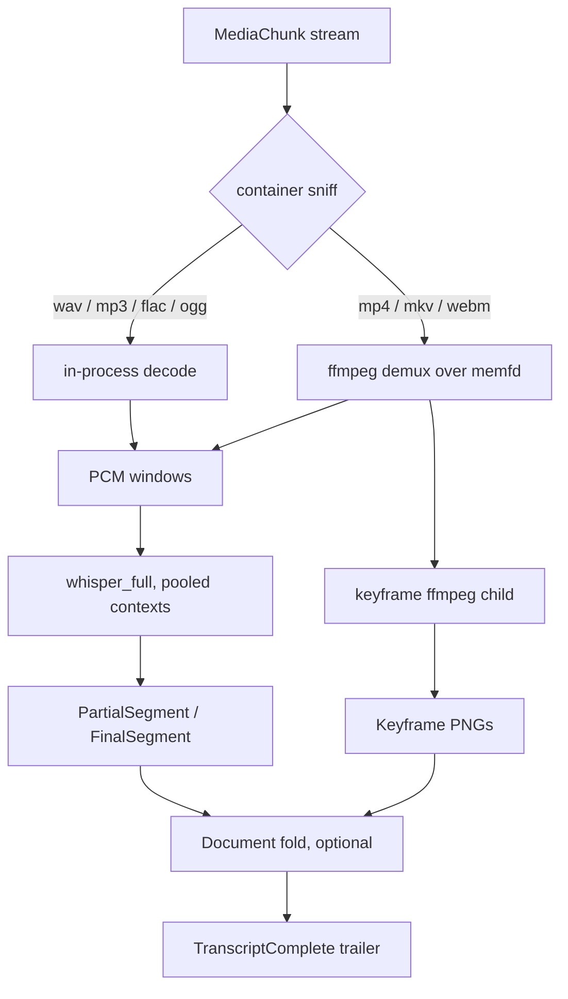

# grpc-asr architecture

**Status:** spec (no implementation yet)
**Updated:** 2026-08-13

Implementers start at [`AGENTS.md`](../AGENTS.md), then this file, `design.md`, and `guidelines.md`.

## Where this sits

Running Whisper inside a general document-conversion process steals the GPU
from layout and OCR work and ties ASR to Python. This service is the
isolated collector for the same feature: it takes audio or video bytes,
streams transcript events back, and hands results to the gRParse
coordinator (`COLLECTOR_ASR`), which merges them into a Document. Optional
keyframe stills from video feed the CV path.

Keep ASR out of gRParse itself: OCR and layout session pools and Whisper
weights do not share a device arena.

## Live results

Segments are emitted as the decoder commits them, and keyframes as they are
extracted, so a UI can show the transcript growing, including on a two-hour
file. A batch convert that returns one document at the end cannot do that.
Partial segments are allowed; finals replace them by index.
`TranscriptComplete` is a trailer.

## What this process owns

Audio decode and transcription, on whisper.cpp (GGML, CUDA, Metal, Vulkan,
or OpenVINO builds), never `openai-whisper`. Video is demuxed to its audio
track, with optional keyframe stills emitted as `PictureItem`s or raw PNGs
so gRParse can run layout on slides. Timed segments (`start`, `end`,
`text`, optional word timestamps) are projected as `TextItem`s with time
provenance, plus a WebVTT-shaped sidecar the sink can export as
`OutputFormat.VTT`. Language detection runs in the decoder. The served
models are the Whisper family (tiny through large-v3, plus distil
variants); weights are files on disk, not a pip extra.

## What this process does not own

| Concern | Owner |
|---|---|
| Diarization, speaker names | later; out of scope for v1 |
| Translation as a product feature | whisper.cpp `task=translate` may be an option, not the default |
| Chunking / embeddings | downstream of Document |
| Export to VTT files | protomolt sink, from the timed items |
| Page OCR | gRParse CV |

## Language

C++. whisper.cpp is the system of record; wrapping it in Python would
recreate the conversion-process cost this service exists to remove. ffmpeg
(or a pure demuxer) is a deployment dependency for video, not a second ASR
stack.

One process, pooled model instances sized by VRAM, bounded concurrent
transcriptions. Fail loud if the requested model file or backend is
missing.

## Hardware

Same doctrine as gRParse: NVIDIA CUDA and Intel OpenVINO are first class,
CPU is explicit. `GRPC_ASR_BACKEND=cuda|openvino|cpu`; do not silently fall
back. A separate container from `grparse-server` so a whisper-large load
cannot evict RapidOCR sessions.
